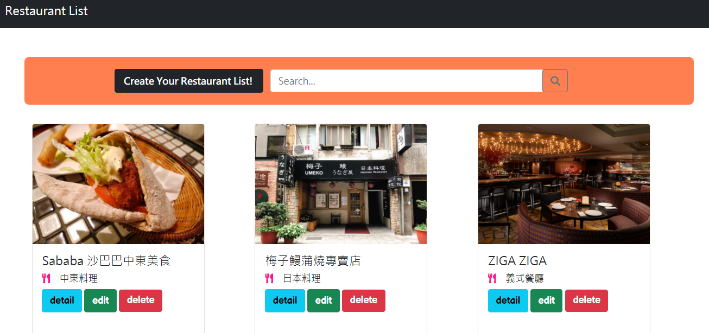
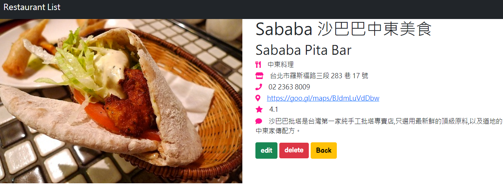
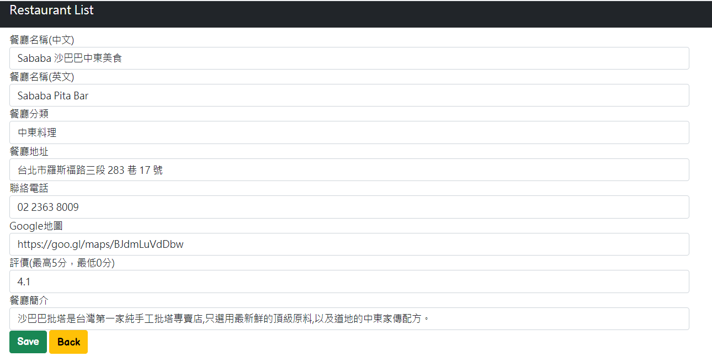

# Restaurant List
打造個人的餐廳清單~
一網打盡好吃美食!

## Features - 產品功能
1. 首頁 -> 使用者可瀏覽所有餐廳清單
2. 搜尋框 -> 使用者可透過關鍵字搜尋相關的餐廳名稱
3. 點擊 Create Your Restaurant List! 按鈕 -> 使用者可創造一筆新的餐廳資料
4. 點擊 detail 按鈕 -> 使用者可瀏覽單一餐廳清單的詳細資料
5. 點擊 edit 按鈕 -> 使用者可編輯單一餐廳清單的詳細資料
6. 點擊 delete 按鈕 -> 使用者可刪除單一餐廳清單
7. 點擊 back 按鈕 -> 使用者可回到首頁

### 首頁

### detail頁面

### edit頁面

## Installing - 專案安裝流程
1. 開啟終端機，執行以下指令 :
> `git clone https://github.com/KarolChang/rubbish_talk_generator.git`

2. 進入專案資料夾
> `cd rubbish_talk_generator`

3. 安裝 npm & 透過 npm 安裝以下套件
> `npm install`

> `npm i express express-handlebars body-parser`

4. 安裝nodemon
> `npm install -g nodemon`

5. 使用腳本啟動專案
> `npm run seed`

> `npm run dev`

> 在瀏覽器進入 http://localhost:3000

## Environment & Tools - 環境&使用工具
* [Visual Studio Code編輯器](https://code.visualstudio.com/)
* [Node.js (v10.15.0)](https://nodejs.org/en/)
* [express框架](https://www.npmjs.com/package/express)
* [express handlebars模板引擎](https://www.npmjs.com/package/express-handlebars)
* [body-parser](https://www.npmjs.com/package/body-parser)

